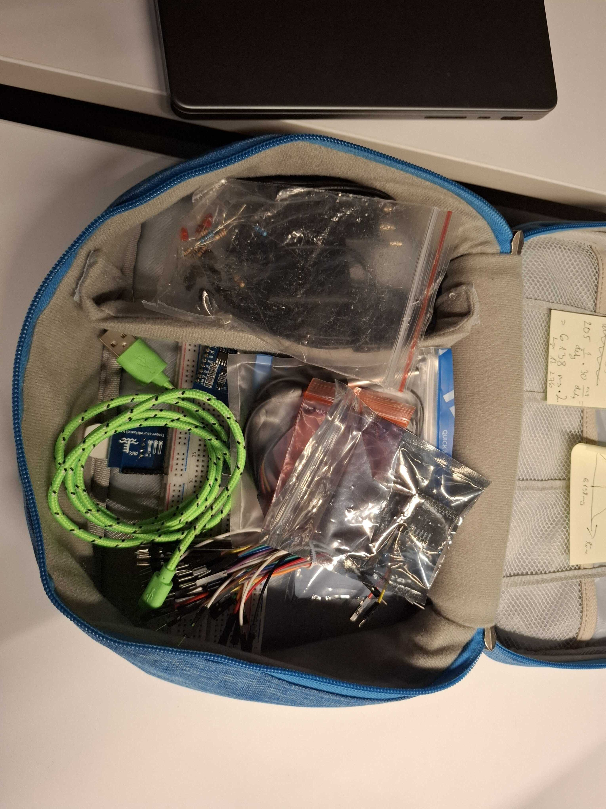
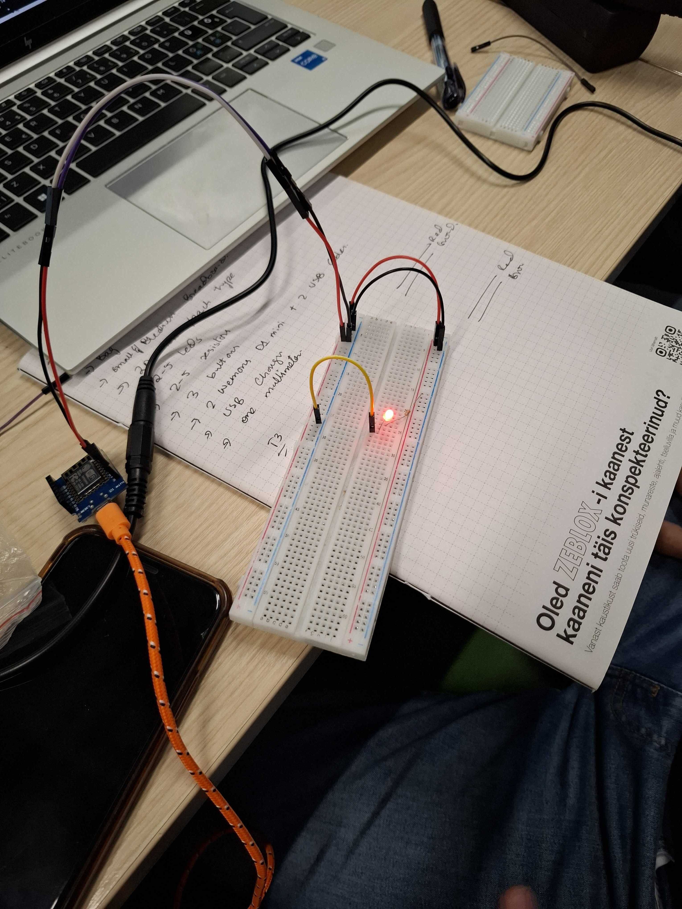
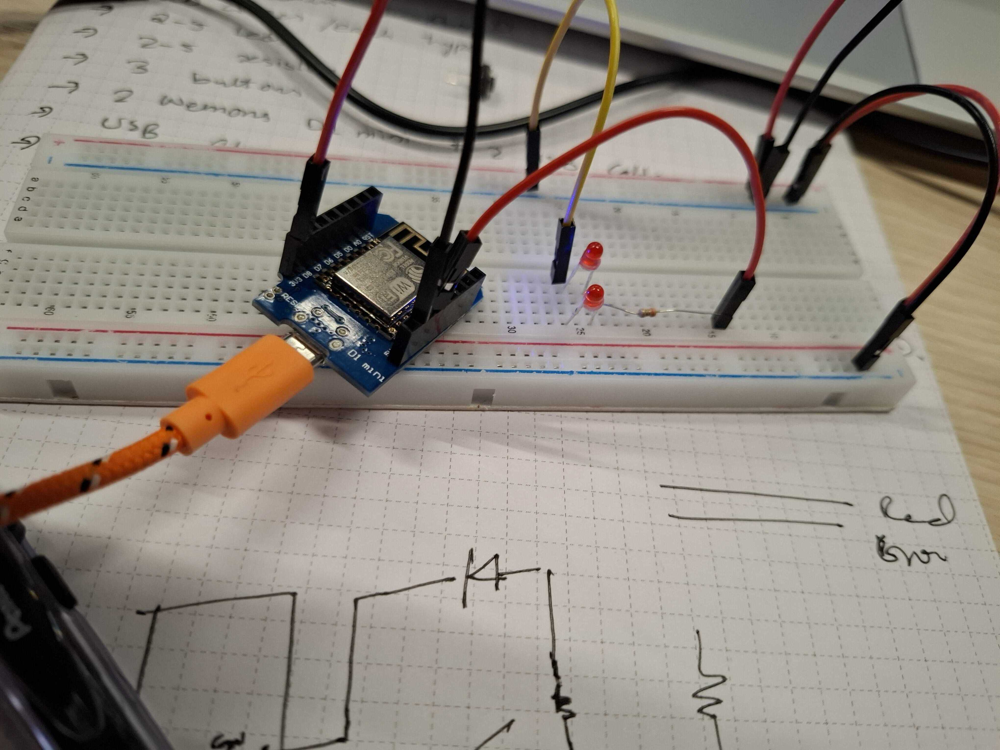
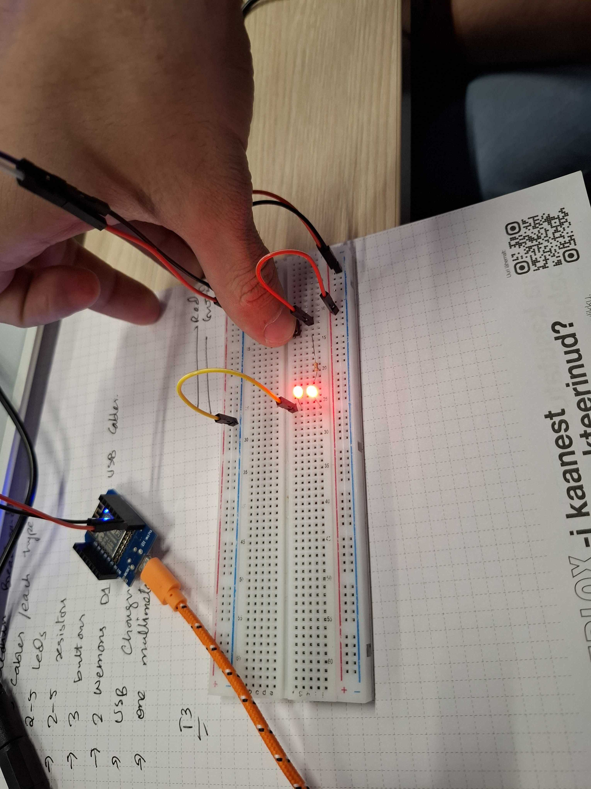
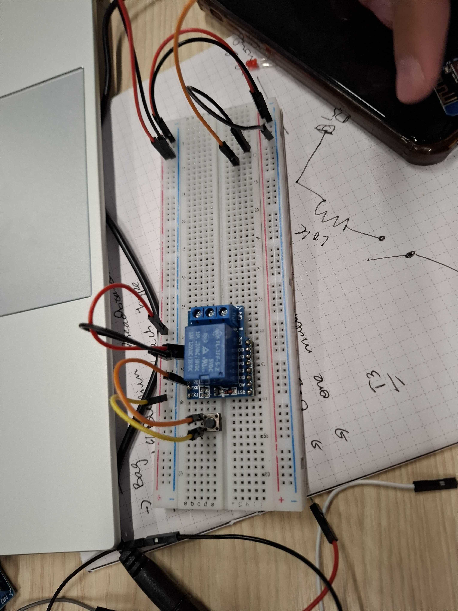

# Module 2

We will make a basic electric circuit. Q: do you know what is an electric circuit? Components: power source, conductive path, load. NB! please do not short your circuits.

The stuff we will use: jumper wires, breadboard, resistor, button, LED
A more details on the internals of the breadboard - between the red and blue lines it is vertical along the long axis of the breadboard (this is for the positive and the ground), and the middle parts are transverse along the long axis, with the two halves being split. If the line is not continuous (the holes have a break between them).

How do LEDs work? The D stands for diode - meaning that current travels only in one direction (look at the circuit symbol, the triangle indicates the direction.
We need a current limiting resistor to protect the resistor, as w/o the resistor the LED overdraws current/power - it will get very bright for a short time, either stops working, splits into two, and sometimes even shoots out a tiny flame (the guys do NOT encourage
The Ohm's law can say what resistor you need, but usually better to use bigger ones (200-300 ohm) If you use even 1 kOhm, still fine, but with 10 kOhm the LED might be a bit dim.
So for instance we would be doing R = (V_supply - V_LED) / I_LED. So an example is

## Task 1

This task was executed by myself. The question task:
**What is an electric circuit (what are the basic properties)?** - a closed, continuous current consisting of a power source, conductive path, and a load
**What is a breadboard for electronic prototyping?** - a convenient tool for connecting (jumper) cables, with holes, and inside there being metal bars running vertical (ground and positive) and transverse (the stuff) to the horizontal axis
**Describe a breadboard - include at least 2 remarkable/memorable features** - nowadays it is white, used to be literally a breadboard (from wood), also other details see previous
**Name one (or two) convention(s) for color coding for cables.** - ground is black (or brown), positive is red. The other color coding I don't really know.
**How do you wire a Light Emitting Diode (LED) to 5V?** - make sure that you connect the correct direction (anode/shorter wire connected to positive), and must have a resistor (caluclate Ohm's law as above, so about 200-300 ohms)
**Describe an LED** - light-emitting diode, has two metal wires from a transparent container. The shorter wire is the anode, the longer is the cathode.
**What is special about (light-emitting) diodes?** - has to be in the single direction
**One thing that seemed unclear (or something very important)** - what differentiates LED from just a regular lightbulb?


## Task 2
This task was executed by me and my partner. The task was to collect the hardware for our next tasks.
We collected:
- 1 blue bag
- 2 long breadboard
- 2 USB-microUSB cable
- ~20 female-to-female jumper cables
- ~30 male-to-female jumper cables
- ~15 male-to-male jumper cables
- 1 12V 1.0A adapter
- 1 Y-cable
- 4 LEDs
- 9 resistors
- 6 buttons
- 2 Wemos D1 Mini
- Dallas temp sensor
- gesture sensor
- touch sensor
- dht22
- rfid + receiver
- solenoid lock
- relay

We are missing:
- 1 medium sized breadboard
- 1 multimeter

A picture of our bag:


## Task 3
In task 3 we are building the "Hello World" of electronic prototyping - making the microcontroller's in-built LED blink, making an LED on a breadboard blink, and then tuning their blinking ordering.
The very first thing was getting the proper board on the Arduino IDE, which at first I struggled with since I was going a roundabout way (some nonsense cloning a git repo into the Arduino sketches folder). However, the proper way to do this was to go File -> Preferences -> Additional boards managers URLs: https://arduino.esp8266.com/stable/package_esp8266com_index.json. These instructions can be found [here](https://github.com/esp8266/Arduino?tab=readme-ov-file#installing-with-boards-manager).

First just turning on the in-board LED and the standalone LED itself is simple once the device starts running. You connect 5V to positive breadboard and GND to negative breadboard. From pos-breadboard you connect a ~300 Ohm resistor to LED anode, and the cathode you connect to ground again. Then, in Arduino IDE you take the blink example sketch. With this current setup, the in-built LED will blink, but the standalone LED will stay on all the time:



## Task 4
Will add later. Had trouble getting Fritzing, didn't want the others since Fritzing has the breadboard nicely visualized.

## Task 5
Task 5 calls to blink also the standalone LED. For that, we disconnect the direct connection from pos-breadboard to the LED anode, and instead connect with jumper cable from one of the D-sockets from the microcontroller (in this case we used D6), to the LED cathode. In the blink example sketch, we need to add another digitalWrite. NB! the reason for having LED_BUILTIN and the D6 LED inverted, is because that way they actually are ON/OFF at the same time synchronously - why is it like that? The reason why, is that the builtin LED works like a pull-up resistor (default state is on, and it is turned off):
```
void setup() {
  pinMode(LED_BUILTIN, OUTPUT);
  pinMode(D6, OUTPUT)
}

void loop() {
  digitalWrite(LED_BUILTIN, HIGH);
  digitalWrite(D6, LOW);
  delay(1000);
  digitalWrite(LED_BUILTIN, HIGH);
  digitalWrite(D6, LOW);
  delay(1000);
```



## Task 6
We can add a button into the circuit, to turn on the LED only when the button is pressed. (NB! this image is using the circuit that is directly in the pos-breadboard, not from the microcontroller socket). However, this one just turns on and off the LED - it does not toggle the LED


To toggle the LED, we took the DigitalReadSerial example sketch, adjusted the pushButton variable to the corresponding GPIO port. This alone still just turns the LED ON while button pressed, and OFF when not pressed. To actually toggle it, we need to put the button between D5 and GND, and the LED between D6 and GND, and do some software magic:
```
int pushButton = D5;
int ledState = LOW;
int lastButtonState = HIGH;

void setup() {
  Serial.begin(9600);
  pinMode(pushButton, INPUT_PULLUP);
  pinMode(D6, OUTPUT);
}

void loop() {
  int buttonState = digitalRead(pushButton);
  if (buttonState == LOW && lastButtonState == HIGH) {
    ledState = !ledState;
    digitalWrite(D6, ledState);
  }
  lastButtonState = buttonState;  
  delay(50); // delay in between reads for stability
}
```
When we press the button, since this is pull-up resistor (INPUT_PULLUP), then buttonState becomes LOW, we enter the if-statement, the ledState is swapped. This allows the LED to be toggled whenever the button is pressed.


## Task 7
In task 7 we should add a relay, that on the control side is powered by the microcontroller's 5V and a button, and on the load side is powered by 12V into a solenoid lock. For that, we connect from microcontroller 5V to pos-breadboard to relay's 5V (the same with GND). In addition, from pos-breadboard we now connect to a button to the signal port (Fedir told us it is D1, but we don't know where we could have looked up this ourselves, as the datasheets for FL-3FF-S-Z were unhelpful). So now, with everything hooked up, we can click the button and hear a sound from the relay:


However, we now want to connect the solenoid. For that, the image on the workbook was really helpful. What we do, is we take the Y-cable, and from the open positive end connect to relay NO (on the opposite side of the GND/5V). Then we connect the solenoid's GND to the Y-cable open GND, and the solenoid's positive to the COM port (middle of the relay's load). Then, when we click the button, the solenoid lock should toggle. An issue we encountered, was that we were using a 12V but 1.0A adapter, which was not enough to toggle the solenoid - when we borrowed one with a higher current from our neighbour, then it worked properly.

Video TBA

## Task 8
The task was to make an LED not toggle just ON/OFF, but also fade between those states smoothly using PWM. For that, we connected an LED from a GPIO pin (D6) through a resistor to GND. We took the Fade example sketch, specified our pin, and just ran it - that caused the fade. We googled that the PWMRANGE is 0 to 1023, so we set the max brightness to 1023. If our fade is set to 5 per cycle, and we have a delay of 30 ms per cycle, then each cycle takes $$2 \cdot \left( \frac{1023}{5} \right) \cdot 30 = 12,276 ms$$
We confirmed this by recording a video of a full cycle, and indeed, it really is 12 seconds.


## Reflection 2
[Reflection 2](/Reflections/ref02.md)
